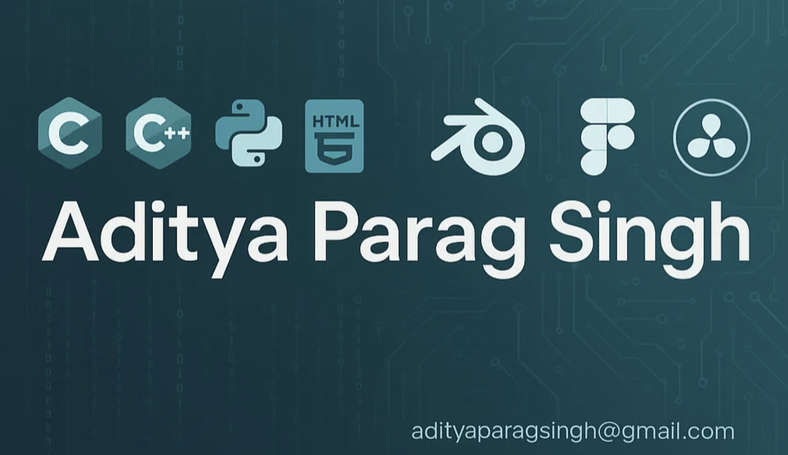

# 💫 About Me:
Hi, I’m @adityaparagsingh "I don't use Arch, btw" :)   👯 I’m looking to collaborate on: Frontend web development projects and electronics-based academic projects.  🤝 I’m looking for help with: JavaScript frameworks like React and understanding core data structures and algorithms.  🌱 I’m currently learning: 3D modelling and full-stack development (JavaScript, React).  💬 Ask me about: C++, HTML/CSS, Figma design, or productivity streaks (1230+ days and counting!).  ⚡ Fun fact: I’ve lived in over 10 states across India and write my To-Do list every single day without fail.

## 🌐 Socials:
   

# 💻 Tech Stack:
                 
# 📊 GitHub Stats:
 
 

## 🏆 GitHub Trophies

### ✍️ Random Dev Quote

### 🔝 Top Contributed Repo

---

<!-- Created by Aditya -->
