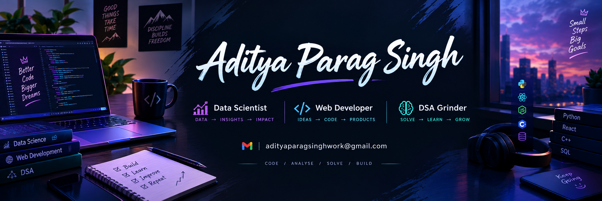

<div align="center">

# ⚡ Aditya Parag Singh


</div>

<p align="center">
  
</p>

---

## 🧠 The Stack in My Head

```
while (alive) {
    solve(dsa_problem);      // sharpening the blade
    build(full_stack_app);   // shipping the thing
    if (streak.days >= 1230) flex();
}
```

<table align="center">
<tr>
<td valign="top" width="50%">

### 🎯 DSA Arsenal
- 🧩 Daily problem-solving grind on **LeetCode**
- 📐 Strong footing in C++ for competitive-style logic
- 🔍 Core focus: arrays, recursion, graphs & DP
- 🏗️ Applying algorithmic thinking to real systems (see: Shell Interpreter)

</td>
<td valign="top" width="50%">

### 🌐 Full-Stack Toolkit
- ⚛️ React + Tailwind on the frontend
- 🔧 Node.js / Express-style backend logic
- 📱 React Native + Expo for mobile builds
- 🗄️ MySQL & MongoDB for data persistence

</td>
</tr>
</table>

---

## 🚀 Featured Builds

<table align="center">
<tr>
<th>Project</th>
<th>What it does</th>
<th>Stack</th>
</tr>
<tr>
<td>🛡️ <b>DataGuard Pro</b></td>
<td>Mobile data-usage tracker with donut gauges & animated tab transitions</td>
<td><code>React Native</code> <code>Expo</code> <code>AsyncStorage</code></td>
</tr>
<tr>
<td>🖥️ <b>Shell Interpreter for Linux OS</b></td>
<td>Custom shell interpreter built with a team, guided by faculty</td>
<td><code>C</code> <code>Systems Programming</code></td>
</tr>
<tr>
<td>🌐 <a href="https://github.com/adityaparagsingh/Website_Clones"><b>Website Clones</b></a></td>
<td>Pixel-precise clones of Netflix and UltraEdit</td>
<td><code>HTML</code> <code>CSS</code> <code>Responsive Design</code></td>
</tr>
</table>

---

## 💫 About Me

> 👯 Looking to collaborate on **frontend web dev** and **electronics-based academic projects**
> 🤝 Looking for help leveling up **React** and **core DSA**
> 🌱 Currently exploring **3D modelling** and deeper **full-stack** patterns
> 💬 Ask me about C++, HTML/CSS, Figma, or how to run a 1230+ day streak without breaking it

---

## 🔗 Connect

<p align="center">
<a href="https://instagram.com/adityaparagsingh" target="_blank"></a>
<a href="https://linkedin.com/in/aditya-parag-singh-68576b31a" target="_blank"></a>
<a href="mailto:adityaparagsingh@gmail.com"></a>
<a href="https://leetcode.com/adityaparagsingh" target="_blank"></a>
</p>

<p align="center">
<a href="https://github.com/adityaparagsingh/view_counter"></a>

</p>

---

## 🧩 LeetCode Stats

<p align="center">
  
</p>

---


---

## 💻 Full Tech Stack

**Languages**


**Web & Mobile**


**Databases**


**Design & Tools**


---

<p align="center">
  
</p>

<p align="center"><i>1230+ days deep into the streak — one commit, one problem, one build at a time.</i></p>

<!-- Created by Aditya -->
